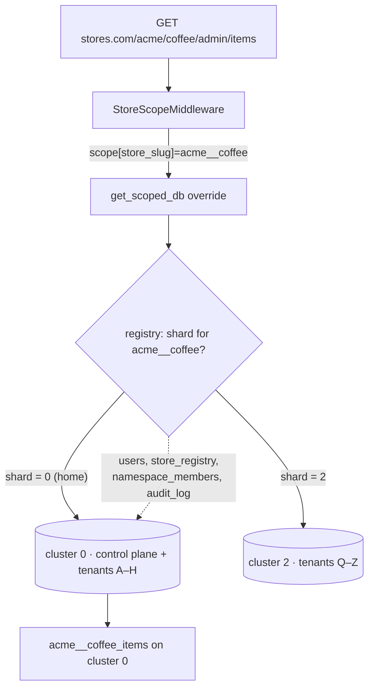

# Sharding AI Stores

[`SCALE.md`](SCALE.md) makes one promise — *one instance serves ten thousand
stores* — and names the wall that promise eventually hits:

> **Collection fan-out.** Each store adds ~6 collections (plus indexes) to the
> one database. Thousands of stores means tens of thousands of collections;
> watch Mongo's per-database limits and index memory. At that scale, sharding or
> splitting the platform across databases becomes the next move.

This document is that next move. It is the plan for *when the wall is real* —
not a change to make today. Splitting the platform across databases/clusters is
a deliberate [non-goal until the per-database limits actually bite](ROADMAP.md#non-goals-for-now);
what follows is how to cross that line **without breaking the guarantees the
rest of the system is built on**: structural isolation, a single global
identity, and "adding a store is a row in `store_registry`, not a deploy."

---

## First, the honest answer: MongoDB *did* fix scale — just not *this*

Sharding is mature and it works. But it is easy to expect the wrong thing from
it, so be precise about what it does:

> **MongoDB sharding scales one big collection across many machines. It does
> nothing about the *number* of collections.**

The pressure here is the opposite shape. A storefront's data is tiny; there are
just a **huge number of tiny scopes**. Every store is its own set of physical
collections — `acme__coffee_items`, `globex__shop_items`, … — because the engine
isolates by prefixing the scope onto the collection name (see
[`SCALE.md`](SCALE.md#scopes-and-reserved-paths)). That collection-per-tenant
shape is a **data-modelling decision on our side**, not a database limitation,
and no amount of sharding collapses it for us:

- Each collection + index is a set of files and a chunk of live metadata the
  storage engine (WiredTiger) keeps resident. Cost grows with **collection
  count**, largely independent of how little data each holds.
- MongoDB's long-standing guidance puts the comfortable ceiling for a single
  replica set in the **low tens of thousands of collections**. You can push past
  it with enough RAM, but startup, index memory, and `listCollections` /
  balancer bookkeeping all degrade.
- Atlas in 2026 will happily auto-scale a cluster and auto-balance a *sharded
  collection* for you. Nothing auto-**collapses** ten thousand per-tenant
  collections into a shape sharding can help with — that is ours to model.

So there are exactly two levers, and they map to the two sections below:

| Lever | What it changes | Buys you |
| --- | --- | --- |
| **A — collapse, then shard** | Fewer, bigger *shared* collections keyed by `app_id`; let native MongoDB sharding spread them | Effectively unbounded tenants; kills the fan-out entirely |
| **B — route across databases/clusters** | Keep per-store collections; split *tenants* across N physical databases | Multiplies the ceiling by N; keeps structural isolation intact |

The recommendation, spelled out at the end, is **B first** (it reuses seams we
already have and preserves the isolation guarantee), **A only at hyperscale**.

---

## Know when the wall is actually near

Do not pre-shard. Watch the signals that the single database is filling up —
these are the `/manage/status` and log-aggregation checklist items in
[`SCALE.md`](SCALE.md#production-checklist) made concrete:

- **Collection count** approaching ~10k on the one `MDB_DB_NAME` database
  (`db.stats().collections`). At ~6 collections/store that is ~1,600 stores as a
  planning number — treat 5k collections as the "start the work" trigger, not
  10k as the "oh no" one.
- **Index working set** no longer fitting in cache (rising cache eviction /
  page faults, `wiredTiger.cache` pressure).
- **Startup / failover time** creeping up as `listCollections` and index loads
  grow.
- **Connection saturation** against `replicas x pool_size` (already flagged in
  [`SCALE.md`](SCALE.md#the-one-stateful-tier)).

Until then, the mitigations already shipped are the right answer: the 60s public
CDN cache, per-store content caps (`MAX_ITEMS_/SECTIONS_/UPLOADS_PER_STORE`), and
per-store export/restore as blast-radius insurance.

---

## What every approach keeps

Sharding changes *where bytes live*, not the platform's contracts. These invariants hold across A and B:

- **`store_registry` stays the single source of truth.** Routing, the
  `KNOWN_STORES` cache, the change-stream watcher, and reconciliation all read
  from it ([`SCALE.md`](SCALE.md#scaling-the-single-instance)). Sharding adds a
  column to a registry row; it does not add a second brain.
- **The scope id is the shard key.** `scope_id(handle, store)` → `{handle}__{store}`
  ([main.py](main.py)) is already the unit of isolation. It is high-cardinality,
  evenly distributed, and — crucially — **every document of one store shares it**
  (the engine tags each doc with `app_id = scope`). That is the textbook
  multi-tenant shard key: a store's queries stay single-target.
- **One re-scoping seam.** Every data path funnels through the `get_scoped_db`
  override — one function, registered once:

```596:602:ai-stores/main.py
        # Store scopes never hold a secret → no token required.
        return await engine.get_scoped_db(slug)
    # Platform scope may require the primary slug's token (secrets manager on).
    return await _platform_db(engine)


app.dependency_overrides[get_scoped_db] = _scoped_db_for_request
```

  Whatever we shard, this stays the place a request learns which physical
  database to talk to.
- **Identity + control plane stay global.** The `users` pool, `store_registry`,
  `namespace_members`, and `audit_log` are cross-tenant by definition; they live
  on a **home/control-plane database** in every design so login and `/manage`
  never have to fan out.

---

## Approach A — collapse the fan-out, then let MongoDB shard

**The idea.** Stop giving each store its own collections. Keep *one* physical
`items`, `sections`, `specials`, … collection for the whole platform, with every
document carrying its `app_id` (the scope). Then enable native MongoDB sharding
on those shared collections, keyed by `app_id`.

This is "the real MongoDB way," and it is the only approach that makes the
collection count **constant** regardless of tenant count.

### Why it fits — the engine already half-did it

The engine **already tags every document with `app_id` equal to its scope and
filters reads on it**. That is visible in the import path, which re-homes `app_id`
so a dump loads into the target scope:

```2169:2175:ai-stores/main.py
        # The engine tags every doc with an ``app_id`` equal to its scope and
        # filters reads on it, so re-home imported docs to the target scope
        # (a dump from another store would otherwise be invisible here).
        prepared = [
            {**d, "app_id": scope} if isinstance(d, dict) and "app_id" in d else d
            for d in docs
        ]
```

So the tenant discriminator exists on every row today. Approach A drops the
*physical* prefix (`{scope}_items` → `items`) and leans entirely on the
*logical* one (`app_id`) that is already there.

### The shard key: `{app_id, _id}`, not `app_id` alone

Shard `items` (and siblings) on the **compound** key `{ app_id: 1, _id: 1 }`:

- Filtering on `app_id` alone still targets a single shard range (prefix rule),
  so a store's reads stay fast and local.
- The trailing `_id` lets a **whale tenant split across chunks**. If you shard on
  `app_id` alone, one huge store is a single shard-key *value* MongoDB cannot
  split — a classic **jumbo chunk** that pins a whale to one shard. The compound
  key avoids it.
- Use **zone sharding** to pin specific tenants (a big customer, an EU tenant) to
  dedicated shards or regions when you need residency or noisy-neighbour
  isolation.

### What has to change

| Seam | Today | Under A |
| --- | --- | --- |
| Collection naming | `{scope}_items` per store | one shared `items`, discriminated by `app_id` |
| `_ensure_store_indexes` ([main.py](main.py)) | per-scope indexes on `{scope}_*` | shard-key + `app_id`-prefixed indexes on the shared collections, once |
| `_drop_store_collections` | drop the `{scope}_*` collections | `deleteMany({app_id: scope})` (range-delete a tenant) |
| Isolation | structural (prefix) **and** `app_id` | **only** `app_id` — every query MUST carry it |
| Provisioning | create collections + seed | insert seed docs tagged with `app_id`; no DDL per store |

### The cost you take on

- **Isolation goes from structural to filter-based.** Today a forgotten tenant
  filter reads *nothing* (wrong prefix). Under A it could read *everyone*. The
  engine centralises the `app_id` filter, so this is survivable — but it moves
  isolation from "impossible to get wrong" to "one shared code path must never be
  wrong." That is the guarantee [`SCALE.md`](SCALE.md#the-decision-that-pays-for-everything)
  and the [cross-store non-goal](ROADMAP.md#non-goals-for-now) lean on, so treat
  the collapse as a security-critical change with its own test suite.
- **Biggest rearchitecture**, and partly in engine territory (the prefixing is
  `mdb-engine`'s behaviour), so it is the least "thin shell over the engine" of
  the options.
- **Shared indexes mean shared blast radius at the collection level** — one
  tenant's pathological data bloats an index everyone reads.

**Verdict:** the right *end state* for millions of tenants, and overkill before
that. It is worth collapsing only the highest-cardinality collections (`items`)
first if the fan-out is dominated by a few collection types.

---

## Approach B — route tenants across databases/clusters (recommended first move)

**The idea.** Keep everything about a store exactly as it is — per-store
`{scope}_*` collections, structural isolation, the whole provisioning flow — but
stop assuming there is *one* physical database. Put the store's **home shard** on
its `store_registry` row and teach the one re-scoping seam to open the right
connection.

This is application-level sharding. It does not use MongoDB's balancer at all; it
uses the thing we already have — a **registry that every request already
consults** — to route.



### Why it fits this codebase almost perfectly

1. **The registry is already the router.** `provision_store` writes the row,
   `refresh_known_stores` reads it, the change-stream watcher reacts to it. Add a
   `shard` field and the same machinery routes physically.
2. **There is one physical-DB accessor to generalise.** Every raw access goes
   through `engine.connection_manager.mongo_db` (the `get_scoped_db` override, the
   `_registry_collection` / `_members_collection` helpers, `_drop_store_collections`,
   export/import, the health ping). Introduce one helper —
   `raw_db_for_scope(scope)` — that resolves a scope's shard to a connection, and
   the ~10 call sites change from "the db" to "the db *for this scope*."
3. **The rebalance tool already exists.** Moving a tenant between shards is
   *export from A → import into B → flip `registry.shard` → drop from A*. The
   per-store export/import is exactly that primitive, and because `app_id = scope`
   is stable across a move, the re-home step is a no-op — only the physical
   database changes. Wire it as `make move-store`, backed by the same
   `deleting`-style reconcile pass that already finishes interrupted drops
   ([`SCALE.md`](SCALE.md#reconciliation)).

### What has to change

| Seam | Change |
| --- | --- |
| `store_registry` row | add `shard` (default `"0"`); backfill existing rows to the home shard |
| Connections | a shard-id → `MongoClient`/DB map, built at boot from config (e.g. `MDB_SHARD_URIS` JSON: `{"0": "mongodb+srv://…", "2": "…"}`) |
| `raw_db_for_scope(scope)` | new helper; resolve `scope`'s shard via the registry (cached), return that cluster's DB handle. Replaces bare `connection_manager.mongo_db` at data call sites |
| `get_scoped_db` override | look up the request scope's shard, hand the engine a scoped DB bound to that cluster |
| `provision_store` | pick the **least-loaded shard** (fewest stores in the registry, or a config policy), persist it on the row *before* creating collections |
| Control-plane collections | `users`, `store_registry`, `namespace_members`, `audit_log` stay on **shard 0** so identity, routing, and audit never fan out |

### The cost you take on

- **You own placement and rebalancing.** No automatic balancer — you decide
  which shard a new store lands on and when to move a whale. That is more policy
  code, but it is *simple, legible* policy that lives next to `provision_store`.
- **Cross-shard platform queries.** Anything that counts *all* stores must read
  the registry (single DB — fine: `/manage/status` already does
  `store_registry.count_documents(...)`) or fan out. Keep aggregate reads on the
  registry, never by scanning shards.
- **Fan-out is divided, not eliminated.** Each shard still accumulates per-store
  collections; B multiplies the ceiling by the number of shards. That is usually
  *plenty* (10k → 100k stores with ten clusters), and you can graduate to A later
  if even that fills.
- **More connection pools / clusters to operate.** Real cost, but each shard is
  operationally identical to today's single database — same image, same backups,
  same probes.

### The bonus you get for free

- **Blast radius shrinks per shard.** A cluster incident affects only its
  tenants, not the platform. That is the isolation win
  [`SCALE.md`](SCALE.md#honest-limits--where-the-model-creaks) says the shared-DB
  model lacks — earned without a full per-tenant-database rearchitecture.
- **Data residency becomes possible.** Pin an EU tenant to an EU shard by
  writing `shard` = the EU cluster. No code path changes — just placement.

---

## Recommended path

1. **Now:** don't shard. Instrument the [signals above](#know-when-the-wall-is-actually-near)
   and alert on collection count + index cache pressure. Keep the CDN cache and
   per-store caps doing their job.
2. **First split (Approach B, one cluster, many databases):** the cheapest real
   step is `shard` pointing at multiple **databases on the same cluster**. It
   multiplies the per-database collection ceiling with almost no new ops surface,
   and proves the `raw_db_for_scope` seam.
3. **Scale B out to clusters:** when one cluster's *total* collection count nears
   the ceiling, point new shards at new clusters. Same code, new URIs. Add
   `make move-store` for rebalancing whales and for residency.
4. **Hyperscale (Approach A, selective):** only if per-cluster fan-out is
   exhausted even after B, collapse the highest-cardinality collections into
   shared, `app_id`-sharded ones — starting with `items`. Do it as a
   security-critical, separately-tested change, since it converts structural
   isolation into filter-based isolation.

Two rules make all of this safe, and both are already how the platform works:
**the registry is the source of truth**, and **every physical access goes
through one seam**. Sharding is not a rewrite here — it is a new column and a new
connection-resolver behind a function that already exists.

See also: [`SCALE.md`](SCALE.md) for the single-instance model these steps
extend, and [`ROADMAP.md`](ROADMAP.md#non-goals-for-now) for why this stays a
non-goal until the collection count makes it a yes.
