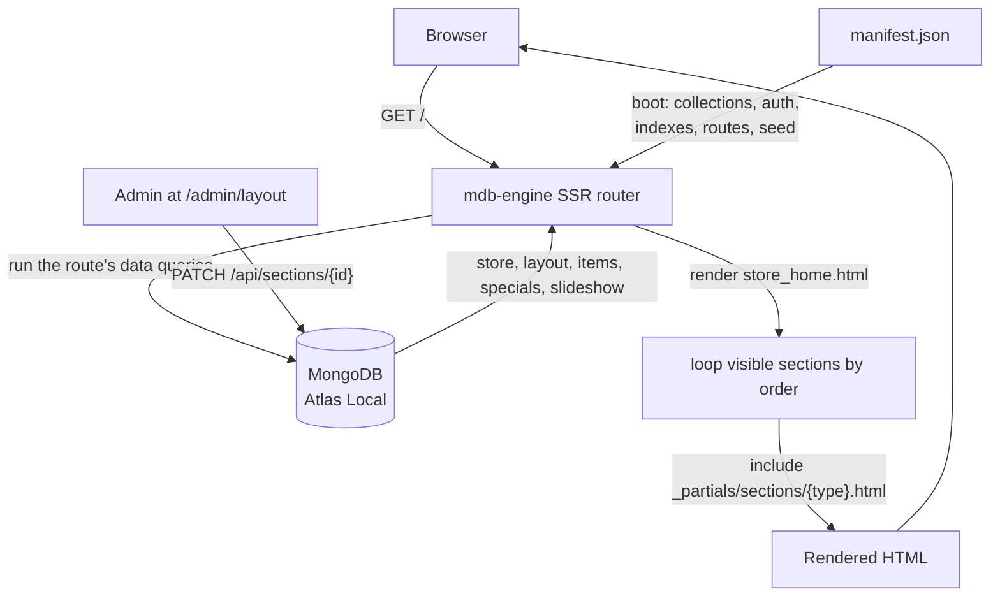
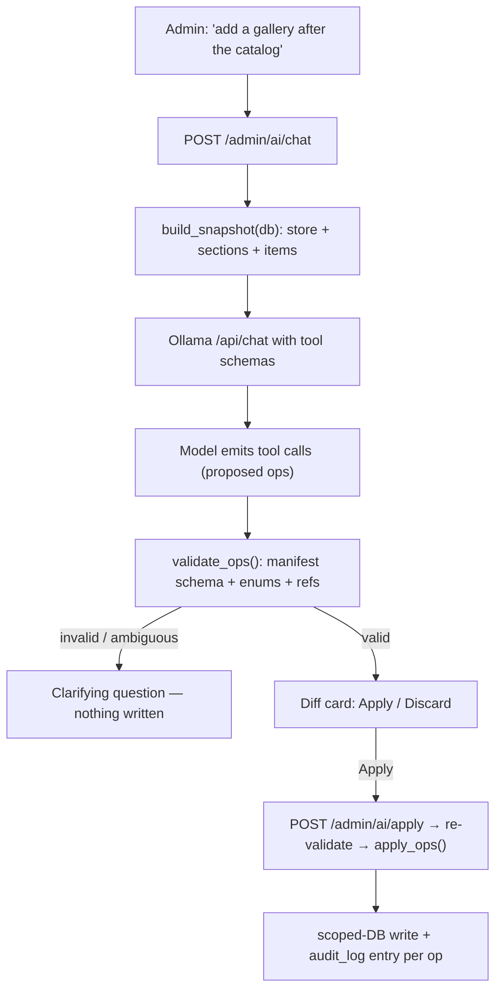

# Your layout is data, not code: how AI Stores works

AI Stores is a white-label, installable storefront (PWA) where **the homepage is
not a template you edit — it's a row of documents you reorder.** An admin drags
sections around, toggles them, tweaks a blob of JSON, and the server-rendered
site changes on the next request. No redeploy. No template surgery.

This post is the "how it actually works" tour: the manifest that *is* the
application, the deliberately tiny Python shell around it, the SSR routes that
are really just queries, and the determinism machinery that lets a fresh clone
reconcile to a known-good store every time.

> **Update:** there's now a real LLM feature — an admin **conversational
> editor** backed by a *local* Ollama model. It's built on the same ethos as
> everything else here: the model only *proposes*, the manifest *validates*, and
> the admin *confirms*. See
> ["The conversational editor"](#the-conversational-editor-propose-validate-confirm).

> **Update:** AI Stores is now **multi-tenant**. One app instance serves many
> stores at `stores.com/{store}`, managed by one shared admin, with each store's
> data isolated in its own `{slug}_*` collections. A store is a per-request
> *scope*, created at runtime from `/manage` — no redeploy. The "data, not code"
> and "propose → validate → confirm" ethos below is unchanged; only the scope of
> "a store" moved from *one per deploy* to *one per request*. See
> [`SCALE.md`](SCALE.md) and [`README.md`](README.md) for the architecture.

---

## The 10,000-foot view

Everything hangs off [`mdb-engine`](https://pypi.org/project/mdb-engine/): a
FastAPI + MongoDB engine that turns a declarative `manifest.json` into
collections, auto-CRUD, auth, managed indexes, an admin control plane, and
server-side rendered routes. `main.py` is a thin shell that boots the engine and
adds the handful of things a manifest can't express.



The mental model: **the manifest declares the system, MongoDB stores the state,
and the templates are pure functions of that state.**

---

## `main.py`: a deliberately slim shell

The whole app is booted in one call. From `main.py` (around line 70):

```python
app = quickstart(
    slug=_manifest_data["slug"],
    name=_manifest_data.get("name", APP_NAME),
    manifest=MANIFEST_PATH,
    title=_manifest_data.get("name", APP_NAME),
    description=_manifest_data.get("description", ""),
)
```

`quickstart` reads the manifest and wires up collections, auto-CRUD, auth,
indexes, and the `/__mdb/*` admin plane. Then SSR routes are mounted from the
same manifest (line 80):

```python
mount_ssr_routes(
    app,
    TEMPLATES_DIR,
    _ssr_cfg,
    collections_config=_manifest_data.get("collections", {}),
)
```

What's left in `main.py` is exactly the stuff that doesn't belong in a manifest:

- `POST /api/submit-inquiry` (line 202) — a single public write path so
  anonymous visitors can submit the contact form without opening the
  `inquiries` collection to public writes.
- `POST /admin/upload-image` and `POST /admin/upload-video` (lines 252 and 323)
  — admin-gated Cloudinary uploads with size limits and video transcoding
  transforms, because the engine doesn't ship a managed uploader.
- `POST /admin/ai/chat` and `POST /admin/ai/apply` — the conversational editor's
  propose and apply endpoints (logic lives in [`ai_editor.py`](ai_editor.py)).
  The chat endpoint only *reads* and proposes; the apply endpoint *writes* after
  re-validation. Covered in its own section below.
- The startup seeding reconciler (line 161), covered below.

That's the entire "custom" surface. Everything else — the schema, the CRUD, the
auth, the routes — is declared, not coded.

---

## The manifest is the application

[`manifest.json`](manifest.json) (`schema_version: 2.0`) is the single source of
truth. Its top-level blocks:

| Block | What it declares |
| --- | --- |
| `auth` | App-user auth (`app_users`), the session cookie, protected vs public routes, login rate limits, and the seeded admin (`demo_users` via `{{env.ADMIN_EMAIL}}` / `{{env.ADMIN_PASSWORD}}`). |
| `collections` | The data model: `stores`, `sections`, `items`, `specials`, `slideshow`, `inquiries`, `users`, `audit_log` — each with a JSON schema, `auto_crud`, per-collection auth (e.g. `public_read` + `write_roles: ["admin"]`), scopes, and hooks. |
| `managed_indexes` | Indexes the engine creates and reconciles on startup. |
| `ssr` | Server-rendered routes, robots, and sitemap (see below). |
| `admin_api` | The `/__mdb` control plane: `reconciler`, `trash`, `secrets`, `audit`, and a public `health` module. |
| `manifest_tracking` | Change-tracking + `protect_collections` guarding destructive ops. |
| `initial_data` | The seed content a fresh database reconciles toward. |

Because the schema, permissions, and routes all live in one declarative file,
"add a field" or "add an index" is a manifest edit plus a reconcile — not a
migration script.

---

## SSR: routes that are really queries

An SSR route binds a URL to a template and a set of named queries. Here's the
homepage route from `manifest.json` (the `ssr.routes["/"]` block):

```json
"/": {
  "template": "store_home.html",
  "data": {
    "store":     { "collection": "stores",   "limit": 1 },
    "layout":    { "collection": "sections",  "scope": "visible", "sort": { "order": 1 }, "limit": 50 },
    "items":     { "collection": "items",     "scope": "showcase", "sort": { "date_added": -1 }, "limit": 12 },
    "specials":  { "collection": "specials",  "sort": { "date_created": -1 }, "limit": 6 },
    "slideshow": { "collection": "slideshow", "sort": { "order": 1 }, "limit": 50 }
  },
  "seo": {
    "title":       "{{ store.name }} — {{ store.tagline }}",
    "description": "{{ store.about_text }}",
    "og_image":    "{{ store.hero_image_url }}"
  },
  "cache": { "ttl": "60s", "scope": "public" }
}
```

The engine runs those queries, injects the results into the Jinja2 context, fills
in SEO/OpenGraph tags, and caches the response for 60s. Note `layout` is just
"the `sections` collection, filtered to the `visible` scope, sorted by `order`."
That single query is the entire secret behind the composable homepage.

Admin routes (`/admin/layout`, `/admin/items`, ...) use the same mechanism with
`"auth": true` so the engine enforces a session before rendering.

---

## The sections model: layout as data

Each row in the `sections` collection is one homepage block:

| Field | Purpose |
| --- | --- |
| `key` | Stable unique identity (used by the deterministic seed). |
| `type` | One of `hero`, `catalog`, `specials`, `richtext`, `gallery`, `contact`, `cta`. |
| `order` | Render order (ascending). |
| `visible` | Show/hide on the storefront. |
| `nav_label` | If set, the section appears in the header nav. |
| `anchor` | In-page `id` for nav/scroll. |
| `settings` | Free-form per-type config. |

The template does something almost anticlimactic — it loops the sections and
includes a partial per type. From `templates/store_home.html`:

```jinja

  

```

`ignore missing` means an unknown `type` can never break the page. `settings` is
whatever that partial wants to read. For instance the seeded `catalog` section
ships as:

```json
{ "heading": "Our Catalog", "subheading": "", "columns": 3 }
```

Change `columns` to `4` from `/admin/layout` and the grid reflows on the next
request. **Adding a whole new section type** is three small steps:

1. Add `templates/_partials/sections/<type>.html`.
2. Add `"<type>"` to `sections.schema.properties.type.enum` (and to the
   `<select>` in `admin_layout.html`), plus an entry in the `section_types`
   registry (partial + settings schema) — the latter also drives settings
   validation and the AI editor.
3. Optionally add a seed row under `initial_data.sections` with a unique `key`.

No change to the loop, the route, or the admin plumbing.

---

## Determinism: idempotent, additive seeding

Storefront content no longer lives in `manifest.json` — it lives in
[`store_template.json`](store_template.json), the bundle copied into **each new
store scope** when it's provisioned. Provisioning (`provision_store` in
`main.py`) is idempotent and **purely additive**: it inserts what's missing by a
stable key and never overwrites an admin's edits, so re-running it (or a retry
after a partial failure) is always safe.

Two strategies do the seeding:

- `_seed_singleton` — insert only when the collection is empty. Used for the
  `stores` doc (one store singleton per store scope).
- `_seed_by_key` — insert any seed doc whose key isn't already present. Used for
  `sections` (by `key`) and `items` (by `item_code`).

The heart of it is matching on identity, not position:

```python
async def _seed_by_key(db, collection_name, key_field, docs):
    collection = db[collection_name]
    existing = set()
    async for doc in collection.find({}, {key_field: 1}):
        val = doc.get(key_field)
        if val is not None:
            existing.add(val)

    new_docs = [
        {**doc, "created_at": doc.get("created_at", datetime.now(timezone.utc))}
        for doc in docs
        if doc.get(key_field) not in existing and doc.get(key_field) is not None
    ]
    if new_docs:
        await collection.insert_many(new_docs)
```

The payoff: **every newly provisioned store starts from the same known-good
template**, and re-running provisioning to add a new default section makes it
appear *without* wiping the sections an admin already customized. Combined with
pinned dependencies in [`requirements.txt`](requirements.txt) (including
`mdb-engine==0.15.1`), boots and store creation are reproducible.

---

## The admin plane and GitOps reconciler

`admin_api` mounts a control plane under `/__mdb`:

```json
"admin_api": {
  "enabled": true,
  "path_prefix": "/__mdb",
  "modules": {
    "reconciler": { "enabled": true, "scopes": ["read", "apply"] },
    "trash":      { "enabled": true, "scopes": ["read", "restore", "purge"] },
    "secrets":    { "enabled": true, "scopes": ["rotate"] },
    "audit":      { "enabled": true, "scopes": ["read"] },
    "health":     { "enabled": true, "public": true }
  }
}
```

This gives you a GitOps-style workflow for schema changes: edit the manifest,
**read** the plan (a dry run of what would change), then **apply** it. A trash
with restore and an audit log round it out. `manifest_tracking.protect_collections`
guards `inquiries`, `users`, `audit_log`, and `sections` from destructive
operations. The `health` module is the public liveness probe the container's
healthcheck hits at `/__mdb/health/live`.

The typical loop:

```bash
curl -s http://localhost:8000/__mdb/reconciler/plan | jq     # what would change
curl -s -X POST http://localhost:8000/__mdb/reconciler/apply # apply (as admin)
# then commit manifest.json — it is your migration history
```

(Exact paths track your installed `mdb-engine` version; browse `/docs`.)

---

## The conversational editor: propose, validate, confirm

The newest feature lets an admin edit the store by *talking to it* — "add a
gallery after the catalog", "mark the Gift Card as sold", "change the tagline"
— without learning where each control lives. The interesting part isn't that it
uses an LLM; it's how little the LLM is *trusted*.

The runtime is a local [Ollama](https://ollama.com) container (default
`qwen2.5:7b-instruct`), so `docker compose up` stays fully self-contained: no
external API keys, no data leaving the box. The whole feature is a new module,
[`ai_editor.py`](ai_editor.py), plus two thin endpoints in `main.py` and a
front-end widget.



### The model proposes; it never writes

The chat endpoint sends the model a small, tightly-described **tool set** (one
function per allowed change: `add_section`, `toggle_section`, `update_store_info`,
`create_item`, `set_item_status`, `create_special`, …) and a compact **snapshot**
of the current store for grounding. It parses the returned tool calls into raw
ops — and then hands them to `validate_ops`, which is where all the trust lives:

- **Enums & schema** — a section `type` must be in the `section_types` registry;
  an item `status` must be one of the manifest enum; settings are checked
  against each type's declared settings schema.
- **Referential checks** — `remove_section`/`toggle_section` must name an existing
  `key`; `update_item` must resolve to a real `item_code` or name.
- **Allowlists** — `update_store_info` accepts only human-facing copy fields; every
  `theme_*`/font/radius field is rejected (theme belongs to the Appearance panel).
- **Coercion** — prices and discounts are parsed from messy strings (`"$49.99"`),
  new section keys and item codes are de-duplicated.

Invalid or ambiguous requests never produce a write — they come back as a
clarifying question or a rejected-op message. What the admin sees is a
human-readable **diff**, not raw JSON:

```text
Add section: gallery ("Our Work") at after:catalog
```

### Confirm, then apply — with an audit trail

Only after the admin clicks **Apply** does `POST /admin/ai/apply` run. It
**re-validates the ops against a fresh snapshot** (the store may have changed
since the proposal), then `apply_ops` executes each through the same scoped DB
the rest of the app uses, writing an `audit_log` entry per change:

```python
await db["audit_log"].insert_one({
    "event": "ai_store_update",
    "actor": actor,            # the logged-in admin
    "source": "ai_editor",
    "detail": {"fields": ["tagline"]},
    "timestamp": datetime.now(timezone.utc),
})
```

Discard is a genuine no-op (the proposal was never persisted). This mirrors the
GitOps reconciler's *read → confirm → apply* loop — the same guardrail ethos,
now driven by natural language.

### Why this is robust with a small local model

Weaker local models are shakier at tool-calling, so the design leans on
everything *except* the model: a small tool surface with enums, snapshot
grounding, hard server-side validation, and a mandatory confirm step. A bad
proposal is caught before it can ever become a bad write — the worst case is a
clarifying question, not a corrupted store.

---

## Reproducible from a clone: the packaging

The determinism story extends to how it ships:

- **[`Dockerfile`](Dockerfile)** — a multi-stage build (deps compiled in a
  `builder` stage, then a slim runtime), runs as a **non-root** user, and defines
  a `HEALTHCHECK` that curls `/__mdb/health/live`.
- **[`docker-compose.yml`](docker-compose.yml)** — the app plus
  `mongodb/mongodb-atlas-local` (a single-node replica set, reached with
  `?directConnection=true`). The app's `depends_on` uses
  `condition: service_healthy`, so it doesn't start until Mongo can answer
  `ping` — no flaky boot races. A third service, `ollama`, provides the local LLM
  for the chat editor; the app reaches it over the compose network and degrades
  gracefully (a clear 503) if no model has been pulled yet.
- **[`Makefile`](Makefile)** — one-command DX. `make init` writes a `.env` with a
  real base64 32-byte `MDB_ENGINE_MASTER_KEY` and a `MDB_JWT_SECRET`, so
  encryption is actually enabled on the very first boot instead of silently
  disabled by a placeholder.
- **[`.dockerignore`](.dockerignore)** — keeps `.git`, `.env`, and caches out of
  the build context.

The result is the TLDR from the README: `git clone`, `make init`, `make up`, and
about a minute later a fully seeded storefront is live at
`http://localhost:8000`.

---

## Extending it

Because the manifest is the application, most changes are declarative:

- **New homepage block** → a partial + an enum entry (+ optional seed row).
- **New field on a product** → add it to `items.schema`, reconcile.
- **New collection** → declare it under `collections` with `auto_crud: true` and
  you get CRUD + auth + indexes for free.
- **New content** → add rows under `initial_data`; the additive seeder brings
  them in on the next boot without disturbing live edits.

The parts that genuinely need code — a public write path, third-party uploads —
stay small and explicit in `main.py`.

---

## Takeaways

- **Layout as data** collapses a whole class of "just move this section" tickets
  into an admin action with zero deploys.
- **A manifest as the single source of truth** keeps schema, permissions,
  indexes, and routes in one reviewable, version-controlled file.
- **Additive, key-based seeding** makes a fresh clone deterministic while
  respecting live customization — the best of "seed data" and "don't clobber my
  edits."
- **Packaging is part of correctness**: healthcheck-gated dependencies, generated
  secrets, and pinned versions are why `make up` just works.
- **Trust the manifest, not the model**: the conversational editor turns English
  into *validated proposals* — the schema, an allowlist, and a mandatory confirm
  step (not the LLM) are what keep every write safe.

Start with the [README](../README.md), then poke at `manifest.json` — it's the
fastest way to see the whole system at a glance.
